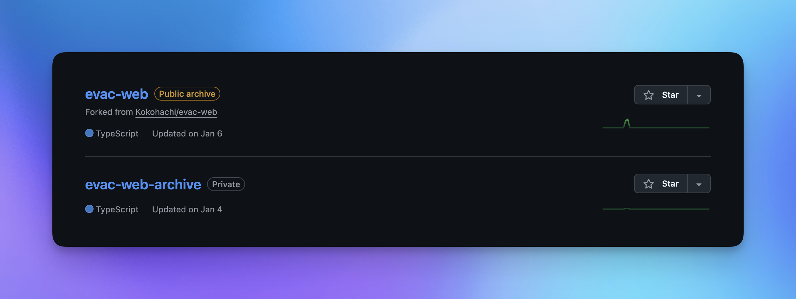
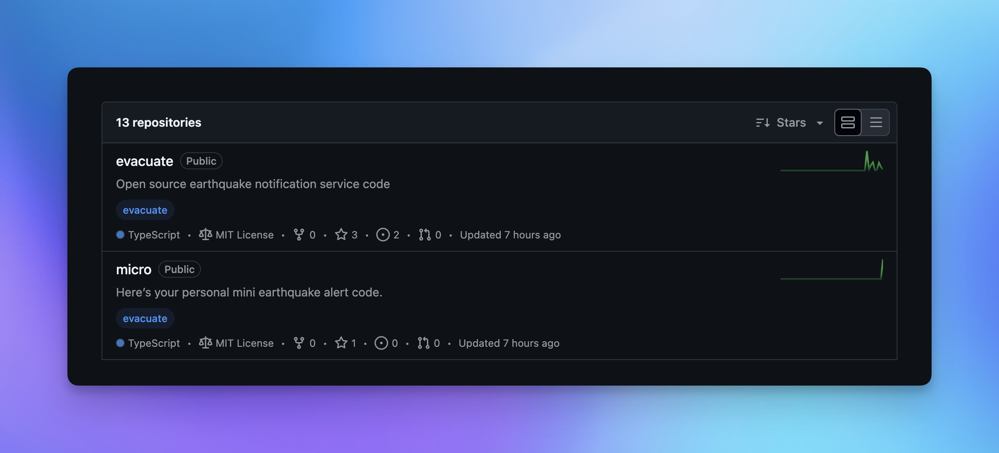

## About this Repository

This repository contains only the `README.md` that describes the background and experiences leading to the creation of my earthquake information service `evacuate`. Through this repository, I hope you will understand how I came to work on this project.

## Background of Creation

In 2024, after seeing the news of the earthquake off the Noto Peninsula, I decided to challenge myself to team development for the first time.

The start was when I found a tweet on Twitter while searching for "earthquake," inviting people to develop an open-source earthquake information service together. At that time, I had just started programming and couldn't do much technically, but I was strongly attracted to the project and joined the team with the firm belief that "there must be something I can contribute."

As a result, the first repository I created was [`evac-web`](https://github.com/minagishl/evac-web). This repository was for developing a website to provide earthquake information.

> Unfortunately, the above service did not go public, but at the same time, I created another repository, [`disaster-platform`](https://github.com/minagishl/disaster-platform). This is an integrated platform for providing disaster information, which I hope will develop in the future.

My first commit to `evac-web` was not only about programming skills but also a new experience in collaborating with a team to advance the project. While working with team members, I grew technically, but in the end, the website was never released.

However, this experience became extremely valuable to me and was a major turning point that led to my decision to create my own earthquake information service. With that determination, I built [`evacuate`](https://github.com/evacuate/evacuate).

## Future Prospects

Currently, development is progressing with a focus on the `evacuate` repository, and I have finally been able to realize a service that provides earthquake information. In the future, I aim to further enhance the service by integrating more disaster information and providing real-time, rapid information delivery. I am also considering implementing a user-friendly interface and expanding the features. This repository is very important to me, and I work daily with the goal of further growth and service improvement.

## Conclusion

This repository records my first experience participating in team development and the growth I gained through it. This experience became a major turning point for me, pushing me to decide to create an earthquake information service myself. I will continue to use this experience to provide a service that can benefit more people.

Translation provided using ChatGPT 4.
