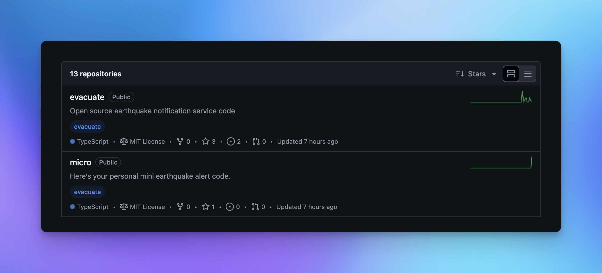

## このリポジトリについて

このリポジトリは、私が地震情報サービス `evacuate` を作成するに至った経緯や、その背景となった経験を記載した `README.md` のみのリポジトリです。このリポジトリを通じて、私がどのようにしてこのプロジェクトに取り組むようになったかを知ってもらえればと思います。

## 作成の背景

2024 年、能登半島沖地震のニュースを見たことが、私が初めてチーム開発に挑戦しようと決意したきっかけでした。

Twitter で「地震」と検索していた際に、オープンソースで地震情報を提供するサービスを一緒に開発しようというツイートを見つけたことがスタートでした。当時の私はプログラミングを始めたばかりで、技術的には何もできない状態でしたが、このプロジェクトに強く惹かれ、「自分にも何かできることがあるはず」と強い意志でチームに参加しました。

その結果、私が初めて作成したリポジトリが [`evac-web`](https://github.com/minagishl/evac-web) です。このリポジトリは、地震情報を提供する Web サイトを開発するためのものです。

> 上記のサービスは、残念ながら公開には至りませんでしたが、並行してもう一つのリポジトリ [`disaster-platform`](https://github.com/minagishl/disaster-platform) も作成しました。こちらは災害情報を統合的に提供するプラットフォームとして、今後の発展に期待を寄せています。

`evac-web` での私の最初のコミットは、プログラミングのスキルだけでなく、チームで協力してプロジェクトを進めるという新たな経験でもありました。チームメンバーと共にプロジェクトを進める中で、技術的な成長を遂げましたが、最終的に Web サイトは公開に至りませんでした。

しかし、この経験は私にとって非常に貴重なものとなり、地震情報サービスを自分で作成することを決意する大きなきっかけとなりました。そして、その決意のもとで作り上げたのが [`evacuate`](https://github.com/evacuate/evacuate) です。

## 今後の展望

現在、`evacuate` リポジトリを中心に開発を進めており、ついに地震情報を提供するサービスを実現できるようになりました。今後は、さらに多くの災害情報を統合し、リアルタイムでの迅速な情報提供ができるようなサービスの充実を目指しています。また、ユーザーが簡単にアクセスできるインターフェースの実装や、機能の拡張も視野に入れています。このリポジトリは私にとって非常に大切であり、今後のさらなる成長とサービスの向上を目指して日々取り組んでいます。

## まとめ

このリポジトリは、私が初めてチーム開発に参加した経験と、それを通じて得た成長を記録したものです。この経験は、私にとって大きな転機となり、地震情報サービスを自ら作り上げるという決意を後押ししました。今後もこの経験を糧に、より多くの人々の役に立てるサービスを提供できるよう、精進していきます。
